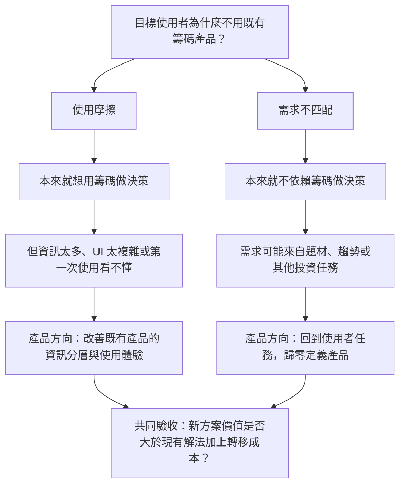

# 8/12 Check-in：Lite 方向的下一個決策問題

> 狀態：結構草稿。本文整理本次 Check-in 對「籌碼 K 線 Lite／新手產品」命題的影響，不代表產品方向已拍板，也不代表使用者需求已被驗證。

若要回查完整時間碼、近原話與證據邊界，請閱讀[本人發言與 BU Heads 回饋完整整理](<2026-08-12-Check-in-本人發言與BU-Heads回饋.md>)。

## 本文要回答的決策問題

在繼續以「籌碼 K 線 Lite」服務目前不使用籌碼工具的新手以前，我們需要先判定：

> 目標使用者不用既有籌碼產品，是因為他本來想用籌碼做投資決策、卻被資訊量與操作門檻擋住；還是因為他的投資決策方法原本就不依賴籌碼？

這不是同一個問題的兩種說法，而是會導向不同產品策略的兩條路：前者偏向改善既有產品，後者需要從目標使用者的投資任務重新定義產品。

## 一句話結論

這次 Check-in 沒有決定籌碼面應該繼續或停止，而是把下一個判斷門檻說清楚了：**在增加更多籌碼內容或繼續設計 Lite 前，先分辨目前面對的是使用摩擦，還是需求不匹配。**

## 我的原始假設

我當時的思考起點是：投資包含多個面向，但第一階段不應一次把所有面向放進同一條產品路徑，因此先選籌碼面作為驗證切口。

原始假設可以拆成三步：

1. 先讓新手看懂籌碼面，降低第一階段需要理解的範圍。
2. 如果「讓新手看懂」的方法能在籌碼面走通，再將方法擴充到其他投資面向。
3. 因此先只做籌碼，不在第一版同時加入其他面向。

這能支持「籌碼面是有意識選擇的探索切口」，但不能證明籌碼是新手真正需要的入口，也不能證明籌碼面上的理解方法可以自然外推。

## BU Heads 挑戰的隱含前提

BU Heads 挑戰的不是「籌碼面完全不值得做」，而是原始方向在進入解法前，隱含了幾個尚未驗證的前提：

1. **目標使用者有籌碼需求**：新手有買個股，不等於他會用籌碼做投資決策。
2. **不使用主要來自工具門檻**：非使用者可能覺得既有產品太複雜，也可能根本不需要這類工具。
3. **簡化既有產品足以帶來採用**：即使 UI 與資訊量改善，新方案仍必須好到足以克服使用者的轉移成本。
4. **第一個切口可以向外擴充**：籌碼面走通，不代表同一套理解方式能直接套用到其他投資面向。

因此，真正應先回答的不是「籌碼 K 線要怎麼變簡單」，而是「我們想服務的使用者現在如何做投資決策，以及他為什麼不用既有產品」。

## 使用摩擦／需求不匹配問題樹

兩條分支都還需要使用者證據。這次錄音只能證明 BU Heads 提出了這個分岔，不能證明目標族群實際落在哪一側；而且若尚未鎖定單一族群，市場上也可能同時存在兩種人。

## 對目前方向的影響

### 仍然成立

- 第一階段需要縮小範圍，不宜一次塞入所有投資面向。
- 籌碼面可以作為一個待驗證的探索切口。
- 新手第一次使用時的資訊分層與理解門檻值得檢查。

### 尚未成立

- 目前不使用籌碼產品的新手，主要是被複雜度擋住。
- 把籌碼 K 線做簡單，就能觸及新的使用者。
- 籌碼面建立的理解方式，可以自然擴充到其他投資面向。
- 目前方案相對既有解法的價值，足以克服轉移成本。

### 對下一輪工作的含義

下一輪不應先增加更多籌碼內容，而應先定義要研究的目標族群，了解他現在如何做投資決策、為什麼不用既有工具，再判斷應該改善既有籌碼產品，還是重新定義面向新手的產品。

## Reference

- [本人發言與 BU Heads 回饋完整整理](<2026-08-12-Check-in-本人發言與BU-Heads回饋.md>)
- [完整 TXT 逐字稿](<2026-08-12-check-in-逐字稿.txt>)
- [原始 M4A](<check_in[2].m4a>)

