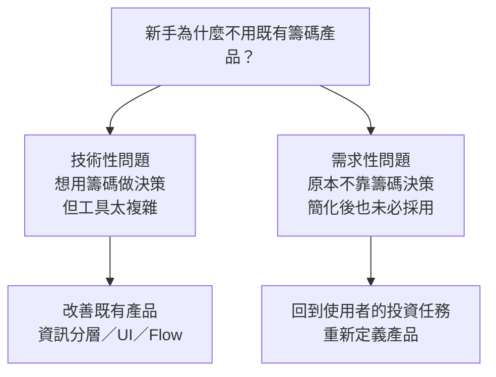

  <h1>8/12 Check-in</h1>
  
<strong>主管回饋、反思與下一步</strong>

  
<code>2026-08-12</code>

---

> 本 repo 保存 2026-08-12 Check-in 的原音、逐字稿、本人發言與 BU Heads 回饋整理。

## Context

我原先以「先做籌碼面，走通後再擴充到其他投資面向」探索籌碼 K 線 Lite。

## 這次主管回饋的核心

主管指出，目前的思考從「籌碼 K 線 Lite」直接進入了 Solution。

在繼續簡化介面或增加內容以前，應先回答一個更前面的問題：

> 新手為什麼不用既有籌碼產品？

原因不同，會導向不同的產品方向。

### 技術性問題

如果使用者本來就想用籌碼做投資判斷，只是既有產品的資訊量、操作方式或理解門檻太高，方向應是改善既有產品。

可能的做法包括資訊分層、漸進式揭露，以及調整第一次使用時的 UI 與 Flow。

### 需求性問題

如果使用者原本就不靠籌碼做投資決策，將籌碼 K 線簡化，也不一定會讓他開始使用。

此時應回到這群人的投資任務、決策方法與現有解法，重新思考要提供什麼產品，而不是預設籌碼是入口。

## 主管建議先回答的問題

1. 目標使用者現在如何完成投資決策？
2. 他為什麼不用既有產品或工具？
3. 現有解法造成了什麼具體痛點？
4. 問題來自功能與介面的摩擦，還是需求本身不同？
5. 新方案的價值是否足以克服使用者的轉移成本？
6. 所謂「十倍好」，要如何用時間、金錢或任務結果衡量？

## 主管提出的兩個例子

### 襯衫與拉鍊

如果一個人不穿襯衫，是因為不喜歡襯衫，把鈕扣換成拉鍊也不會產生需求。

這個例子用來區分：問題究竟是產品不好用，還是使用者根本不需要這類產品。

### 改善既有產品與重新創造產品

主管以 Robinhood 為例說明，面向新使用者的產品不一定只是從複雜產品中刪除功能，也可能需要重新設計 UI、互動方式與整體產品組合。

因此，「簡化既有產品」與「為不同使用者重新定義產品」是兩條不同路線。

## 我的反思

我目前還沒有分清楚：新手不用籌碼產品，主要是使用摩擦，還是投資需求與方法不同。

## 下一步

先釐清目標使用者的需求、決策方式與現有解法，再決定應改善既有產品，或重新定義產品方向。

## 證據邊界

這次回饋提出了需要釐清的問題，但沒有證明籌碼面不值得做，也沒有拍板 Lite 應繼續、併入既有產品或停止。

錄音不包含真人使用者研究，因此不能用來證明需求、採用或產品價值成立。

## 文件導覽

- [本人發言與 BU Heads 回饋完整整理](<2026-08-12-Check-in-本人發言與BU-Heads回饋.md>)
- [完整 TXT 逐字稿](<2026-08-12-check-in-逐字稿.txt>)
- [原始 M4A](<check_in[2].m4a>)
- [會後延伸思考](<2026-08-12-下一步決策與判斷依據.md>)
- [產品決策層級補充筆記](<產品決策層級-Product-Focus-Product-Principle-Solution-Hypothesis.md>)
